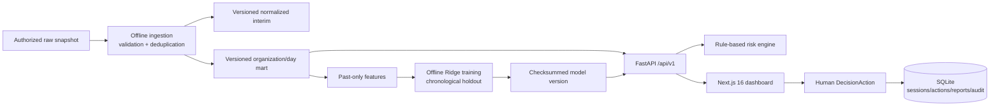
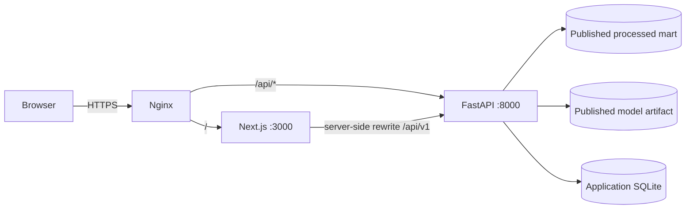

# MedFlow AI

GovTech Decision Support System для мониторинга и прогнозирования нагрузки медицинских организаций Казахстана. Система отделяет текущий снимок очереди от прогноза новых дневных регистраций и оставляет управленческое решение за ответственным специалистом.

## Что решает система

Пакетные выгрузки здравоохранения велики, чувствительны и не подходят для чтения на каждый HTTP-запрос. MedFlow AI проверяет и агрегирует разрешённый снимок offline, публикует компактную витрину, обучает проверяемую модель и отдаёт интерфейсу только ограниченные агрегаты. Это позволяет видеть региональную картину, необычные изменения и ожидаемый поток новых регистраций, не передавая raw-записи в браузер.

## Возможности

- сводные KPI, региональная аналитика и локальная SVG-карта Казахстана;
- прогноз новых регистраций по медицинским организациям с интервалом неопределённости;
- глобальная важность и локальные знаковые вклады Ridge;
- статистические аномалии и отдельный прозрачный risk engine;
- черновики `DecisionAction` с human-in-the-loop статусами;
- неизменяемый снимок отчёта, CSV/XLSX/print export и demo checksum verification;
- provenance, freshness, health компонентов и версионирование data/model;
- Argon2id login, opaque sessions, RBAC (`viewer`, `analyst`, `admin`) и audit log;
- Light / Dark / System тема без flash неверной темы.

## Screenshots

Скриншоты намеренно не подменены макетами. После развёртывания проекта сюда можно добавить реальные изображения:

- `docs/screenshots/dashboard-light.png` — обзор и карта;
- `docs/screenshots/dashboard-dark.png` — прогноз и explainability;
- `docs/screenshots/decision-action.png` — human-in-the-loop диалог.

## Architecture



Runtime-запрос не читает `data/raw` и не запускает обучение:



Подробные схемы: [docs/ARCHITECTURE.md](docs/ARCHITECTURE.md).

## Data Pipeline

1. Авторизованный снимок `*Ожидающие плановую*.csv` помещается в `data/raw/`.
2. `app.cli ingest` потоково проверяет обязательные поля, допустимость даты и идентификаторов, дедуплицирует события во временной SQLite и пишет нормализованный gzip в `data/interim/`.
3. Данные агрегируются до `organization × day`. Для отсутствующих дней создаётся нулевое наблюдение; признаки строятся только из предыдущих значений.
4. Валидированная CSV-витрина и metadata публикуются в `data/processed/mart_versions/<version>/`.
5. Малый `current_mart.json` переключается атомарно через `os.replace`. Ошибка не меняет рабочую версию.
6. Offline training читает только опубликованную витрину и атомарно публикует checksummed artifact в `ml/artifacts/versions/<version>/` через `current_model.json`.
7. FastAPI загружает только текущие processed/model версии и application SQLite.

Incremental ingestion в текущей реализации означает безопасный skip неизменившегося source по `filename:size:mtime`; изменившийся snapshot перестраивается полностью. Это не CDC и не real-time stream.

## ML

**Target:** `daily_waiting_registrations` — количество новых регистраций в очередь за календарный день среди записей, остающихся в предоставленном снимке. Это **не будущий полный размер очереди** и не полный исторический поток: уже выбывшие записи в snapshot отсутствуют.

Фактическая production-модель — `Ridge(alpha=3.0, solver="lsqr")` в scikit-learn `Pipeline`:

- `organization_id` → `OneHotEncoder(handle_unknown="ignore")`;
- календарные и числовые признаки → `StandardScaler`;
- признаки: weekday, month, weekend, lag 1/7/14/28, rolling mean/std 7, past trend и historical anomaly z-score;
- первые 28 точек каждой организации исключаются из train/validation;
- последние 20% уникальных дат — единый chronological holdout;
- preprocessor fit выполняется только на train;
- baseline — persistence предыдущего дня (`lag_1`);
- модель оценивается по MAE, RMSE и WAPE; model selection в текущем коде — фиксированный Ridge, а не перебор нескольких candidates.

Текущие значения метрик не зафиксированы в README: смотрите UI «Информация о модели», authenticated `GET /api/v1/model/info` или `ml/artifacts/versions/<version>/metadata.json`. Artifact связан с fingerprint витрины; несовпадение или checksum error даёт `MODEL_NOT_READY`.

### Explainability

Global importance — модуль коэффициента преобразованного признака; он зависит от масштаба и encoding. Local contribution вычисляется как `transformed feature value × Ridge coefficient`, имеет знак роста/снижения и вместе с intercept восстанавливает линейный прогноз до non-negative clipping. Технические имена отображаются человеку понятными группами. Вклады и корреляции описывают статистическую связь, **не причинность**.

### Risk Engine

Prediction и risk — разные контуры. [config/risk_thresholds.yaml](config/risk_thresholds.yaml) задаёт пороги, а `app.core.risk.assess_risk` суммирует баллы:

| Сигнал | Баллы |
|---|---:|
| forecast / historical mean ≥ 1.15 / 1.35 / 1.75 | +12 / +25 / +35 |
| recent trend ≥ 20% / 50% | +16 / +25 |
| anomaly z ≥ 2.5 / 3.5 | +15 / +25 |
| current snapshot queue ≥ 500 / 1500 | +10 / +20 |
| forecast error ≥ 20 | +5 |

Score ограничен 100: `<20 normal`, `20–44 attention`, `45–69 high`, `70–100 critical`. Пороги аналитические, не клинические нормы. В UI статус всегда имеет текст/метку, а не только цвет.

### Human-in-the-loop

Система не ставит диагноз, не назначает лечение и не исполняет административное действие. `DecisionAction` создаётся как `draft`; переходы `approved/rejected/completed` выполняет пользователь с соответствующей ролью и фиксируются в audit log.

### Data Privacy

Raw может содержать чувствительные и квазиидентифицирующие поля. Публичная граница витрины задаётся `PUBLIC_FIELDS`; patient identifiers, диагнозы, возрастные и финансовые атрибуты не входят в model/API/export. Агрегация сама по себе не гарантирует анонимность — production требует политики доступа, retention и review владельца данных. Подробнее: [docs/PRIVACY.md](docs/PRIVACY.md).

## Technology Stack

| Layer | Реализация |
|---|---|
| Frontend | Next.js 16.3.6, React 19.2.0, TypeScript 5.9.3, CSS variables |
| Backend | Python 3.12, FastAPI 0.141.1, Uvicorn 0.52.0, Pydantic 2.13.5 |
| Data | Python stdlib streaming CSV/gzip, SQLite staging, versioned CSV mart |
| ML | scikit-learn 1.9.0, NumPy 2.5.3, joblib 1.6.0 |
| Database | SQLite 3: sessions, login rate limit, actions, reports, audit |
| Security | Argon2id, RBAC, token digests, TrustedHost/CORS, request limits |
| Proxy | Nginx unprivileged 1.27.3; TLS завершается внешним GovTech proxy |
| Deployment | Docker Compose, read-only runtimes, dropped capabilities |

## Project Structure

```text
apps/api/app/          FastAPI, auth, storage, risk, pipeline, ML runtime
apps/api/tests/        API, production and hardening tests
config/                risk thresholds and verified mappings
data/raw/              authorized source snapshot (ignored by Git)
data/interim/          normalized/checkpoint data (ignored by Git)
data/processed/        versioned mart + local SQLite (ignored by Git)
ml/artifacts/          versioned model artifacts (ignored by Git)
frontend/src/          Next.js dashboard and semantic theme
deploy/nginx/          production reverse-proxy template
docs/                  architecture, privacy, data and operations docs
```

## Quick Start — 5 минут

### Requirements

- Linux, macOS или WSL2; Git;
- Python **3.12+**;
- Node.js **20.9.0+** (репозиторий фиксирует 20.18.1 в `.nvmrc`);
- npm 10.x.

> [!WARNING]
> Node.js 18 не совместим с Next.js 16.3.6. Ошибка `Node.js version ">=20.9.0" is required` исправляется обновлением Node, а не downgrade Next.js.

```bash
nvm install
nvm use
node --version   # v20.18.1
npm --version
python3 --version  # 3.12+
```

### Backend

```bash
git clone <REPOSITORY_URL> medflow-ai
cd medflow-ai

python3 -m venv .venv
source .venv/bin/activate
python -m pip install -e .
cp .env.example .env
python apps/api/scripts/generate_password_hash.py
# Вставьте выведенный Argon2id hash в ADMIN_PASSWORD_HASH файла .env.
set -a
source .env
set +a
```

### Data + ML

Положите разрешённый файл `*Ожидающие плановую*.csv` в `data/raw/`. Если администратор передал уже согласованные `data/processed/` и `ml/artifacts/`, этот шаг не нужен.

```bash
python -m app.cli ingest
python -m app.cli train
python -m app.cli status
```

`train` повторно использует валидный artifact с тем же fingerprint; для принудительного retrain используйте `python -m app.cli train --force`.

### Запуск backend

```bash
python -m uvicorn app.main:app --reload --host 127.0.0.1 --port 8000
```

### Запуск frontend

В отдельном терминале:

```bash
cd frontend
nvm use
npm ci
npm run dev
```

- Frontend: <http://localhost:3000>
- API: <http://127.0.0.1:8000/api/v1>
- API docs (development only): <http://127.0.0.1:8000/docs>

### Login

Используйте `ADMIN_EMAIL` и пароль, из которого был создан `ADMIN_PASSWORD_HASH`. Plaintext пароль не записывается в `.env`. DEMO ЭЦП не является интеграцией НУЦ РК; в production он отключён.

### Verify

```bash
curl --fail http://127.0.0.1:8000/api/v1/health
```

Health public; model info требует bearer session. Проверить data/model без login можно через `python -m app.cli status`.

## Environment Variables

| Variable | Required | Purpose | Example |
|---|---|---|---|
| `APP_ENV` | yes | `development` включает docs; `production` выключает docs/demo defaults | `development` |
| `DOMAIN` | production | Nginx server name и TLS path | `example.gov.kz` |
| `CORS_ORIGINS` | production | comma-separated browser origins | `https://example.gov.kz` |
| `TRUSTED_HOSTS` | yes | допустимые HTTP Host | `localhost,127.0.0.1,testserver` |
| `MAX_REQUEST_BYTES` | no | request body limit | `1048576` |
| `ENABLE_DEMO_AUTH` | no | demo ЭЦП; держать `false` в production | `false` |
| `MEDFLOW_DB` | yes | SQLite application state | `data/processed/auth.sqlite3` |
| `ADMIN_EMAIL` | yes | единственная env-configured admin identity | `admin@example.gov.kz` |
| `ADMIN_PASSWORD_HASH` | yes | Argon2id hash, не пароль | `$argon2id$...` |
| `API_INTERNAL_URL` | frontend server | backend для Next rewrite | `http://127.0.0.1:8000` |
| `NEXT_PUBLIC_API_URL` | no | публичный API override | `/api/v1` |

## Tests

```bash
source .venv/bin/activate
python -m pip install -e ".[dev]"
pytest
ruff check .

cd frontend
nvm use
npm ci
npm run typecheck
npm run build
```

Next.js 16 больше не предоставляет `next lint`; отдельный fake lint script не используется.

## Docker

Development backend (порт доступен только на loopback):

```bash
docker compose config
docker compose up --build api
```

Production публикует только Nginx на host-порту `8024`; API и frontend остаются во внутренней network. В GovTech Camp внешний HTTPS и сертификаты обслуживаются инфраструктурой организаторов:

```bash
docker compose -f docker-compose.prod.yml config
docker compose -f docker-compose.prod.yml build
docker compose -f docker-compose.prod.yml up -d
```

Полный порядок TLS, data placement и permissions: [docs/DEPLOYMENT.md](docs/DEPLOYMENT.md).

## API

Все routes имеют prefix `/api/v1`. Основные группы: `health`, `auth`, `regions`, `organizations`, `forecast`, `model`, `anomalies`, `risks`, `data-sources`, `actions`, `reports`, `audit`. Collection routes фильтруются/сортируются до server-side pagination; page size ≤100. Raw rows не входят в контракт.

## Security

Threat model исходит из чувствительных локальных extracts, недоверенного браузера и публичного reverse proxy. Raw монтируется только offline pipeline; runtime containers read-only, без Linux capabilities; API/Next не публикуются на host; TLS завершается в Nginx; login rate limit хранится в SQLite; session token сохраняется только как SHA-256 digest. Secrets не коммитятся. Production checklist: [docs/DEPLOYMENT.md](docs/DEPLOYMENT.md).

## Limitations

- source — batch snapshot, не real-time integration;
- target восстановлен только из остающихся в snapshot регистраций;
- current queue и forecast новых регистраций — разные величины;
- interval основан на holdout residual dispersion и не гарантирует coverage;
- регион организации — доминирующий регион происхождения пациентов, не адрес МО;
- текущий model selection не сравнивает tree/boosting candidates;
- SQLite подходит для одного deployment, но не для multi-writer cluster;
- DEMO ЭЦП и report checksum не являются юридически значимой подписью или интеграцией НУЦ РК;
- privacy approval и operational thresholds должны утверждаться владельцем данных.

## Team / License

Проект подготовлен для GovTech Camp, Case 1. Лицензия самого репозитория не указана; до её добавления права не следует предполагать. GIS asset имеет отдельную MIT attribution в [docs/GIS_SOURCE.md](docs/GIS_SOURCE.md).
