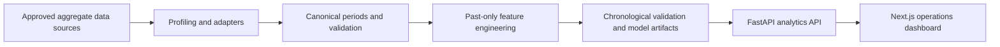

# MedFlow AI

AI-powered decision-support platform for hospital load forecasting and early risk detection. MedFlow AI helps health-system analysts monitor aggregate patient-flow pressure, investigate anomalies, and review short-term queue forecasts in one calm, auditable workspace.

> A GovTech Camp prototype. It supports operational review; it does not diagnose patients, prescribe treatment, or replace accountable human decision-making.

## Key capabilities

- Monitor current waiting queues across medical organizations
- Forecast the near-term hospital-load target with an uncertainty interval
- Surface statistically unusual queue observations with a human-readable explanation
- Review forecast contributors and model limitations in context
- Keep synthetic demonstrations clearly separated from operational source data

## Architecture



The current live application serves deterministic **synthetic demo data**. It deliberately withholds trained-model quality claims until real data has been approved, mapped, trained, and validated. More detail: [architecture](docs/ARCHITECTURE.md), [data model](docs/DATA_MODEL.md), and [ML methodology](docs/ML_METHODOLOGY.md).

## Data setup

Real healthcare datasets are intentionally excluded from version control for privacy, access/licensing, repository-size, and reproducibility reasons. Do not commit sensitive healthcare data.

1. Obtain the authorized files from the organizers or data owner.
2. Place raw extracts in `data/raw/`.
3. Run the read-only inventory/profiling step: `python scripts/profile_data.py`.
4. Review mappings and data-quality findings before ingestion, training, or operational use.

`data/raw/`, `data/interim/`, and `data/processed/` retain only `.gitkeep` placeholders in Git. Tabular formats (`.csv`, `.tsv`, `.xlsx`, `.xls`, `.parquet`, `.feather`, `.arrow`) are ignored. Shareable synthetic fixtures, if needed, belong in a dedicated `data/demo/` or `tests/fixtures/` location.

## Quick start

### Prerequisites

- Python 3.12+
- Node.js 18+
- npm

Start the API:

```bash
python3 -m venv .venv
source .venv/bin/activate
pip install -e .
uvicorn app.main:app --app-dir apps/api --reload --port 8000
```

In a second terminal, start the dashboard:

```bash
cd frontend
npm install
npm run dev
```

Open the dashboard at `http://localhost:3000` and the API documentation at `http://localhost:8000/docs`.

## Development

| Area | Command |
| --- | --- |
| Backend and ML tests | `pytest` |
| Python linting | `ruff check .` |
| Frontend type check | `cd frontend && npm run typecheck` |
| Frontend production build | `cd frontend && npm run build` |
| Data profiling | `python scripts/profile_data.py` |
| Generate demo-only source file | `python scripts/generate_demo_data.py` |

Docker can run the API service:

```bash
docker compose up --build
```

## Project structure

```text
apps/api/       FastAPI endpoints and analytics adapters
frontend/       Next.js operational dashboard
ml/             Feature engineering and ML tests
data/           Local-only raw, interim, and processed data directories
scripts/        Profiling and synthetic-demo utilities
config/         Risk thresholds and approved configuration
docs/           Architecture, privacy, methodology, and data documentation
```

## ML approach and limitations

The intended target is aggregate waiting-queue load. Feature engineering is constrained to information available before the forecast point, and evaluation must use chronological splits. The demo currently uses an interpretable persistence forecast with a residual-based interval and rolling z-score anomaly detection; it is not a trained production model. SHAP or model-quality metrics are shown only after a corresponding model is actually trained and validated. See [ML methodology](docs/ML_METHODOLOGY.md) and the [demo scenario](docs/DEMO_SCENARIO.md).

Current limitations include the absence of authorized real data in this repository, no production database/migrations, no authenticated access layer, and no production model artifact. Review [privacy guidance](docs/PRIVACY.md) before using any data beyond the synthetic demonstration.
