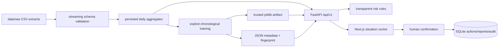

# Architecture

## Runtime dependency map

- `app.core.real_data`: streaming aggregation, fingerprint validation, explicit training and artifact-only runtime loading.
- `app.main`: bounded API contracts, cached aggregates, batched next-day inference and consistent errors.
- `app.core.risk`: configured rule-based assessment; it does not change the model prediction.
- `app.core.provenance`: file inventory and honest batch/freshness status.
- `app.core.storage`: revocable sessions, `DecisionAction`, report registry and audit records in local SQLite.
- `app.core.reporting`: immutable filtered report snapshot, checksum and CSV/XLSX/print exports.
- `frontend`: authenticated server-paginated dashboard; raw extracts never reach the browser.

The request path never trains a model and never substitutes a mock prediction. Missing data produces `DATA_UNAVAILABLE`; a missing, corrupt or fingerprint-mismatched artifact produces `MODEL_NOT_READY`. `/api/v1/health` reports `api`, `dataset`, `model` and `database` separately.

## API

Primary routes: `/health`, `/model/info`, `/model/explain/{organization_id}`, `/regions`, `/regions/{id}/summary`, `/organizations`, `/organizations/{id}`, `/organizations/{id}/forecast`, `/anomalies`, `/risks`, `/data-sources`, `/actions`, `/reports`, and `/audit`, all under `/api/v1`.

The organization and anomaly collections are filtered, sorted and paginated server-side with a maximum page size of 100. Compatibility routes `/metrics` and `/forecasts/{id}` remain available and are marked deprecated.

## Security and audit

Only an environment-configured administrator password hash is accepted. Opaque session token hashes, not tokens, are persisted. DEMO ECP creates an explicitly labelled local demo session and has no certificate or NCA RK integration. Audit records contain user, action, entity and non-secret details; passwords and tokens are excluded.
