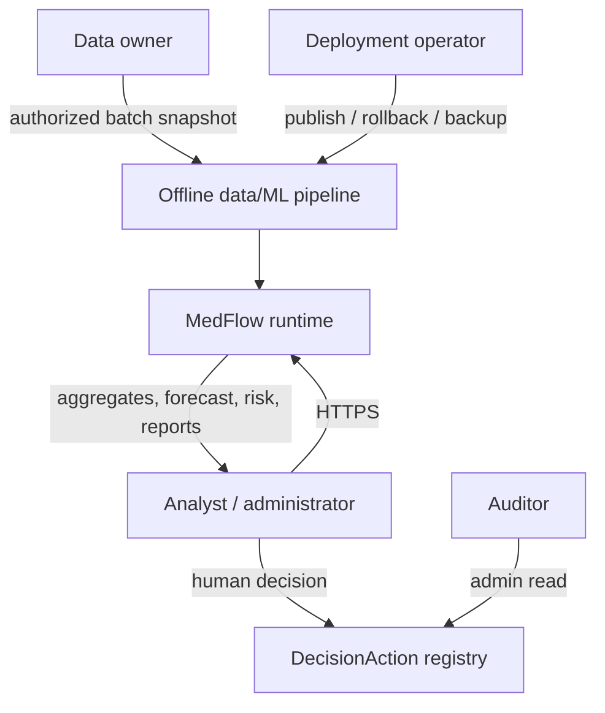
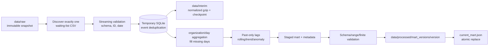
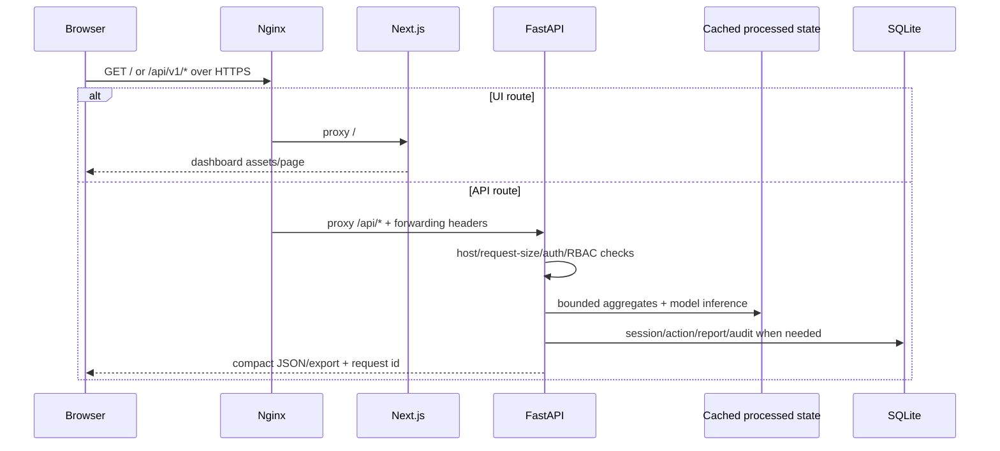
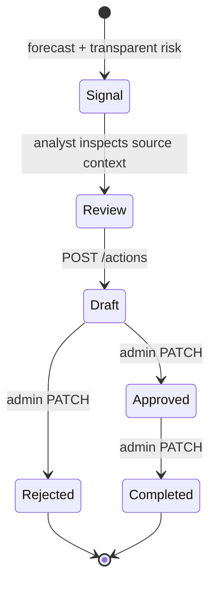
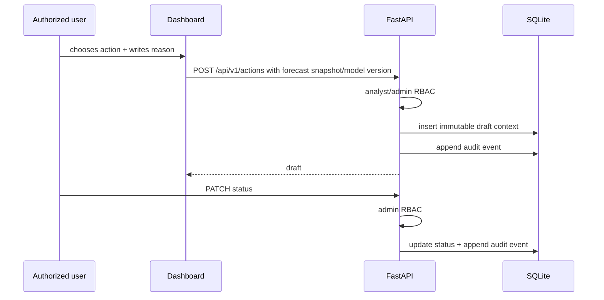

# MedFlow AI — architecture

Документ описывает фактическую production-hardened реализацию. Source of truth: `apps/api/app`, `frontend`, Compose и Nginx config.

## 1. System context



MedFlow — decision support, а не clinical decision maker. Внешние EHR/НУЦ/real-time integrations отсутствуют.

## 2. Data pipeline



`stat_identity = filename:size:mtime_ns` позволяет пропустить неизменившийся snapshot. При изменении source создаётся новая полная версия. Temporary work directory удаляется после завершения; failure checkpoint не переключает current pointer. `source_fingerprint` — SHA-256 source и связь с model artifact.

Raw и normalized данные могут содержать identifiers. Processed mart сериализует только `PUBLIC_FIELDS`: organization/region/date, target, snapshot count и derived past-only features.

## 3. ML lifecycle

```mermaid
flowchart LR
    RAW[Raw snapshot] --> VAL[Validate]
    VAL --> AGG[Aggregate organization/day]
    AGG --> FE[Feature engineering]
    FE --> SPLIT[Chronological 80/20 split]
    SPLIT --> PRE[Fit OneHotEncoder +<br/>StandardScaler on train only]
    PRE --> RIDGE[Train Ridge candidate]
    SPLIT --> BASE[lag-1 persistence baseline]
    RIDGE --> METRIC[Validate MAE/RMSE/WAPE]
    BASE --> METRIC
    METRIC --> SELECT[Fixed production selection: Ridge]
    SELECT --> PUB[Validate checksum/schema<br/>publish version atomically]
    PUB --> LOAD[Backend lazy load]
    LOAD --> INF[Multi-step inference]
    INF --> EXP[Local contributions<br/>x transformed × coefficient]
```



Training вызывается только `python -m app.cli train`; HTTP route для training отсутствует. В коде нет TimeSeriesSplit или перебора candidate families. Holdout — последние 20% уникальных дат, общий для организаций. Первые 28 точек каждой организации не участвуют. Preprocessor и Ridge fit выполняются на train indexes; validation не влияет на scaling/encoding.

Target `daily_waiting_registrations` означает дневные регистрации среди строк текущего waiting-list snapshot, не будущий total queue. Multi-step forecast рекурсивно добавляет предыдущий prediction только для будущего шага. Prediction clips at zero. Residual standard deviation формирует приблизительный interval.

Published directory содержит `model.joblib` и `metadata.json`. Loader проверяет status, source fingerprint, artifact SHA-256 и bundle schema. Он может fallback к более ранней валидной version directory; недоверенный загруженный извне joblib использовать нельзя.

## 4. HTTP runtime



Public routes: health, login и development/demo entry. Остальные `/api/v1/*` требуют bearer session. CORS не используется как auth boundary. TrustedHost, generic login errors, persistent rate limiting, request-size limit и response security headers применяются middleware.

`app.main.dataset()` кэширует один runtime state. Publication mtime token очищает derived LRU caches при смене pointer. Runtime читает mart/model/application DB; `data/raw` не mounted в api container.

## 5. Deployment

```mermaid
flowchart TB
    INTERNET[Internet] -->|80/443 only| NGINX[Nginx unprivileged<br/>TLS + login rate limit]
    subgraph INTERNAL[Docker internal network]
      NGINX --> NEXT[Next.js standalone :3000<br/>read-only / no capabilities]
      NGINX --> API[Uvicorn workers :8000<br/>read-only / no capabilities]
      NEXT --> API
      API --> MART[(processed data :ro)]
      API --> MODEL[(model artifacts :ro)]
      API --> STATE[(named volume<br/>SQLite)]
      PIPE[profile: pipeline] --> MART
      PIPE --> MODEL
    end
    RAW[(host data/raw :ro)] --> PIPE
    CERT[/etc/letsencrypt :ro] --> NGINX
```

Nginx — единственный публичный service. Docker network `internal: true`; API/frontend используют `expose`, не host ports. Pipeline запускается вручную profile-командой и имеет write mounts только на interim/processed/artifacts. Container UID 10001 должен иметь доступ к этим host paths.

## 6. DecisionAction flow





Forecast/model version и snapshot контекста сохраняются вместе с draft. Создание записи не исполняет действие за пределами системы.

## Component map

| Component | Responsibility |
|---|---|
| `app.core.data_pipeline` | offline validate/deduplicate/aggregate/atomic mart publication |
| `app.core.real_data` | mart load, past-only features, training, artifact validation, inference/explainability |
| `app.core.risk` | YAML-configured score independent from model prediction |
| `app.core.auth` | Argon2id login, token digest sessions, persistent rate limit, RBAC |
| `app.core.storage` | DecisionAction, report registry and audit in the same application SQLite |
| `app.core.reporting` | spreadsheet-safe CSV/XLSX, printable HTML and optional PDF export |
| `app.main` | API contracts, bounded pagination/caches, middleware and health |
| `frontend/src` | authenticated Next dashboard, map/charts/reports/theme |

## Failure semantics and observability

- no valid mart → HTTP 503 `DATA_UNAVAILABLE`;
- no matching checksummed artifact → HTTP 503 `MODEL_NOT_READY`;
- invalid/missing session → generic structured `AUTH_REQUIRED`;
- `/api/v1/health` reports API, processed data, model and database independently;
- request logs include request id, route, status, latency and model version, not token/raw row;
- reports/actions/auth events are recorded in application audit.

Rollback switches `current_mart.json` and/or `current_model.json` to an existing validated directory, then restarts API workers. Published versions are immutable; do not edit them in place.
