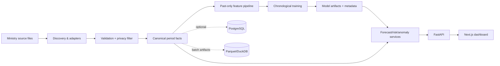

# Architecture

Current MVP stores deterministic synthetic aggregates in code solely to keep the demo runnable. Production ingestion writes canonical aggregates and precomputed forecasts; inference does not train per request.
